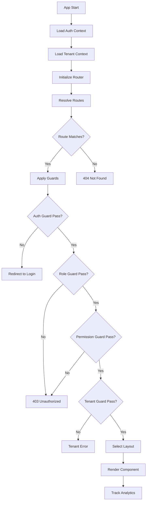
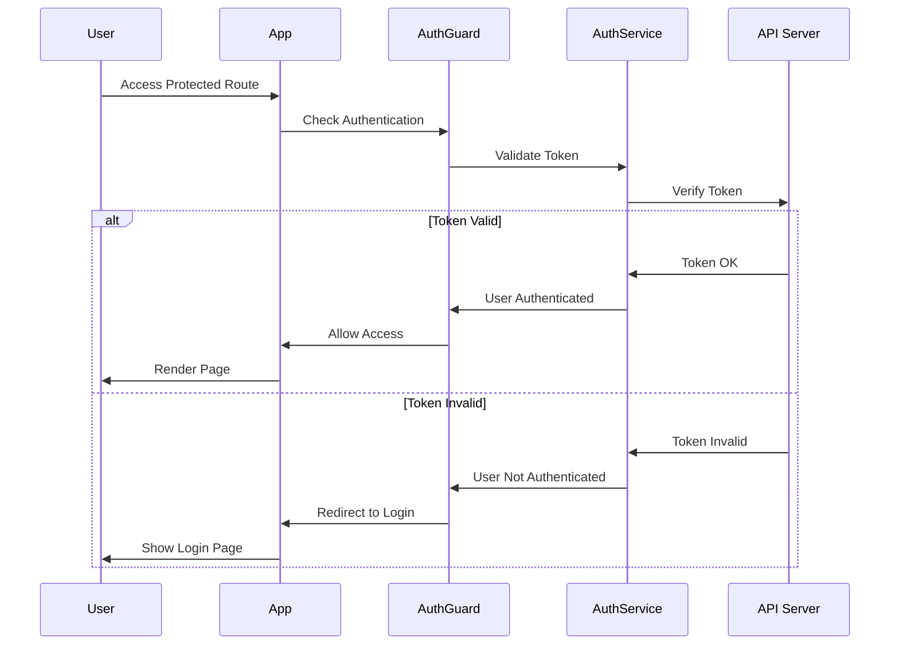
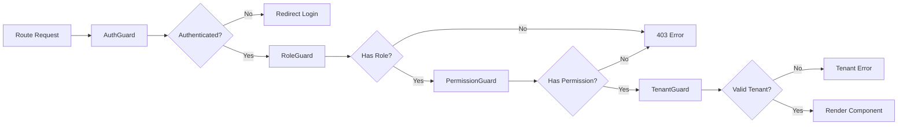

cấu trúc dự án hoàn chỉnh cho Dynamic Router System với TypeScript và React Router DOM.

##Dynamic Router System - Phân Tích & Cấu Trúc

## 1. Cấu Trúc Thư Mục Đầy Đủ

```
src/
├── components/
│   ├── guards/
│   │   ├── index.ts
│   │   ├── AuthGuard.tsx
│   │   ├── RoleGuard.tsx
│   │   ├── PermissionGuard.tsx
│   │   ├── TenantGuard.tsx
│   │   └── GuardComposer.tsx
│   ├── layouts/
│   │   ├── index.ts
│   │   ├── AdminLayout.tsx
│   │   ├── UserLayout.tsx
│   │   ├── PublicLayout.tsx
│   │   ├── TenantLayout.tsx
│   │   └── LayoutProvider.tsx
│   ├── error-boundaries/
│   │   ├── AppErrorBoundary.tsx
│   │   ├── RouteErrorBoundary.tsx
│   │   └── ComponentErrorBoundary.tsx
│   └── ui/
│       ├── LoadingSpinner.tsx
│       ├── NotFound.tsx
│       └── Unauthorized.tsx
├── contexts/
│   ├── AuthContext.tsx
│   ├── TenantContext.tsx
│   ├── RouterContext.tsx
│   └── index.ts
├── hooks/
│   ├── useAuth.ts
│   ├── useTenant.ts
│   ├── usePermissions.ts
│   ├── useRoutes.ts
│   └── index.ts
├── router/
│   ├── DynamicRouter.tsx
│   ├── RouteRenderer.tsx
│   ├── types.ts
│   └── utils.ts
├── services/
│   ├── auth/
│   │   ├── AuthService.ts
│   │   ├── TokenManager.ts
│   │   └── SecurityService.ts
│   ├── tenant/
│   │   └── TenantService.ts
│   ├── api/
│   │   ├── ApiClient.ts
│   │   └── interceptors.ts
│   └── index.ts
├── routes/
│   ├── config.ts
│   ├── guards.ts
│   ├── admin.routes.ts
│   ├── user.routes.ts
│   └── public.routes.ts
├── types/
│   ├── auth.ts
│   ├── tenant.ts
│   ├── route.ts
│   ├── user.ts
│   └── index.ts
├── utils/
│   ├── security.ts
│   ├── validation.ts
│   ├── cache.ts
│   └── constants.ts
├── pages/
│   ├── admin/
│   ├── user/
│   └── public/
└── App.tsx
```

## 2. Các File Type Definitions

### `/src/types/auth.ts`
```typescript
export interface User {
  id: string;
  email: string;
  roles: string[];
  permissions: string[];
  tenantId?: string;
  profile: UserProfile;
}

export interface AuthState {
  user: User | null;
  isAuthenticated: boolean;
  loading: boolean;
  permissions: string[];
  roles: string[];
}

export interface LoginCredentials {
  email: string;
  password: string;
  mfaCode?: string;
}
```

### `/src/types/route.ts`
```typescript
import { ComponentType, ReactNode } from 'react';

export interface RouteConfig {
  path: string;
  component: ComponentType<any> | (() => Promise<{ default: ComponentType<any> }>);
  layout?: string;
  guards?: string[];
  meta?: RouteMeta;
  children?: RouteConfig[];
  exact?: boolean;
  roles?: string[];
  permissions?: string[];
}

export interface RouteMeta {
  title: string;
  description?: string;
  preload?: boolean;
  cache?: number;
  requiresAuth?: boolean;
  public?: boolean;
}

export interface GuardContext {
  user: User | null;
  tenant: Tenant | null;
  route: RouteConfig;
}
```

### `/src/types/tenant.ts`
```typescript
export interface Tenant {
  id: string;
  name: string;
  domain: string;
  config: TenantConfig;
  theme: TenantTheme;
  features: string[];
  permissions: string[];
}

export interface TenantConfig {
  allowedFeatures: string[];
  customizations: Record<string, any>;
  branding: BrandingConfig;
}
```

## 3. Core Components

### `/src/contexts/AuthContext.tsx`
```typescript
import React, { createContext, useContext, useReducer, useEffect } from 'react';
import { User, AuthState } from '../types';
import { AuthService } from '../services';

interface AuthContextValue extends AuthState {
  login: (credentials: LoginCredentials) => Promise<void>;
  logout: () => void;
  refreshToken: () => Promise<void>;
  updateUser: (user: Partial<User>) => void;
}

const AuthContext = createContext<AuthContextValue | null>(null);

export const AuthProvider: React.FC<{ children: React.ReactNode }> = ({ children }) => {
  // Implementation với useReducer
  // Auto token refresh
  // Session management
  // Security logging
};
```

### `/src/router/DynamicRouter.tsx`
```typescript
import React, { Suspense, useMemo } from 'react';
import { BrowserRouter, Routes, Route } from 'react-router-dom';
import { RouteConfig } from '../types';
import { RouteRenderer } from './RouteRenderer';
import { useAuth, useTenant } from '../hooks';

interface DynamicRouterProps {
  routes: RouteConfig[];
}

export const DynamicRouter: React.FC<DynamicRouterProps> = ({ routes }) => {
  const { user, isAuthenticated } = useAuth();
  const { tenant } = useTenant();

  const resolvedRoutes = useMemo(() => {
    return resolveRoutes(routes, user, tenant);
  }, [routes, user, tenant]);

  return (
    <BrowserRouter>
      <Suspense fallback={<LoadingSpinner />}>
        <Routes>
          {resolvedRoutes.map((route, index) => (
            <Route
              key={`${route.path}-${index}`}
              path={route.path}
              element={<RouteRenderer route={route} />}
            />
          ))}
        </Routes>
      </Suspense>
    </BrowserRouter>
  );
};
```

### `/src/components/guards/GuardComposer.tsx`
```typescript
import React from 'react';
import { RouteConfig, GuardContext } from '../../types';
import { AuthGuard } from './AuthGuard';
import { RoleGuard } from './RoleGuard';
import { PermissionGuard } from './PermissionGuard';
import { TenantGuard } from './TenantGuard';

interface GuardComposerProps {
  route: RouteConfig;
  children: React.ReactNode;
}

export const GuardComposer: React.FC<GuardComposerProps> = ({ route, children }) => {
  const guards = route.guards || [];
  
  const renderGuards = (index: number): React.ReactNode => {
    if (index >= guards.length) return children;
    
    const guard = guards[index];
    const nextElement = renderGuards(index + 1);
    
    switch (guard) {
      case 'auth':
        return <AuthGuard>{nextElement}</AuthGuard>;
      case 'tenant':
        return <TenantGuard>{nextElement}</TenantGuard>;
      default:
        if (guard.startsWith('role:')) {
          const role = guard.replace('role:', '');
          return <RoleGuard roles={[role]}>{nextElement}</RoleGuard>;
        }
        if (guard.startsWith('permission:')) {
          const permission = guard.replace('permission:', '');
          return <PermissionGuard permissions={[permission]}>{nextElement}</PermissionGuard>;
        }
        return nextElement;
    }
  };
  
  return <>{renderGuards(0)}</>;
};
```

## 4. Biểu Đồ Hoạt Động Hệ Thống

### A. Flow Chart Chính


### B. Authentication Flow


### C. Guard Chain Flow


## 5. Key Implementation Files

### `/src/routes/config.ts`
```typescript
import { RouteConfig } from '../types';

export const routeConfig: RouteConfig[] = [
  {
    path: '/admin/*',
    component: () => import('../pages/admin/AdminDashboard'),
    layout: 'admin',
    guards: ['auth', 'role:admin'],
    meta: {
      title: 'Admin Dashboard',
      preload: true,
      requiresAuth: true
    }
  },
  {
    path: '/user/*',
    component: () => import('../pages/user/UserDashboard'),
    layout: 'user',
    guards: ['auth'],
    meta: {
      title: 'User Dashboard',
      requiresAuth: true
    }
  },
  {
    path: '/*',
    component: () => import('../pages/public/HomePage'),
    layout: 'public',
    meta: {
      title: 'Home',
      public: true
    }
  }
];
```

### `/src/services/auth/AuthService.ts`
```typescript
export class AuthService {
  private static instance: AuthService;
  private tokenManager: TokenManager;
  
  constructor() {
    this.tokenManager = new TokenManager();
  }
  
  async login(credentials: LoginCredentials): Promise<AuthResponse> {
    // Implement login logic
  }
  
  async refreshToken(): Promise<void> {
    // Implement token refresh
  }
  
  async logout(): Promise<void> {
    // Implement logout logic
  }
  
  getCurrentUser(): User | null {
    // Get current user from token
  }
  
  hasPermission(permission: string): boolean {
    // Check user permissions
  }
  
  hasRole(role: string): boolean {
    // Check user roles
  }
}
```

## 6. Performance Optimization

### Code Splitting Strategy
- Route-based: Mỗi route được split thành chunk riêng
- Component-based: Lazy load heavy components
- Library-based: Vendor chunks riêng biệt

### Caching Layers
1. **Route Config Cache**: Cache cấu hình routes
2. **Permission Cache**: Cache permissions với TTL
3. **Component Cache**: Memoization cho expensive renders
4. **API Cache**: Cache API responses

### Bundle Optimization
- Tree shaking cho unused code
- Code splitting theo routes
- Lazy loading cho non-critical components
- Service Worker cho static assets

## 7. Security Implementation

### Multi-layer Security
```typescript
// Security middleware stack
const securityStack = [
  CSRFProtection,
  XSSPrevention, 
  InputSanitization,
  RateLimiting,
  SessionValidation
];
```

### Token Security
- HttpOnly cookies
- Secure + SameSite flags
- Token rotation
- Device fingerprinting
- IP binding

## 8. Monitoring & Analytics

### Performance Metrics
- Route load time
- Component render time
- Bundle size tracking
- Error rates

### Security Events
- Failed login attempts
- Permission violations
- Suspicious activity
- Token anomalies

## 9. Testing Strategy

### Test Structure
```
__tests__/
├── components/
│   ├── guards/
│   └── layouts/
├── contexts/
├── services/
├── integration/
└── e2e/
```

### Coverage Targets
- Unit tests: 80%+
- Integration tests: 60%+
- E2E tests: Critical paths
- Security tests: All auth flows

## 10. Deployment Checklist

- [ ] Environment configuration
- [ ] Security headers setup
- [ ] HTTPS enforcement
- [ ] CDN configuration
- [ ] Monitoring setup
- [ ] Error tracking
- [ ] Performance monitoring
- [ ] Security scanning
- [ ] Load testing
- [ ] Rollback procedures


 biểu đồ trực quan về luồng hoạt động của hệ thống:

 graph TD
    A[🚀 App Initialize] --> B[🔐 Auth Context Load]
    B --> C[🏢 Tenant Context Load]
    C --> D[🛣️ Dynamic Router Init]
    D --> E[📋 Route Resolution]
    
    E --> F{🎯 Route Match?}
    F -->|❌ No| G[❌ 404 Not Found]
    F -->|✅ Yes| H[🛡️ Guard Chain Start]
    
    H --> I[🔒 Auth Guard]
    I --> J{👤 Authenticated?}
    J -->|❌ No| K[🔄 Redirect Login]
    J -->|✅ Yes| L[👑 Role Guard]
    
    L --> M{🎭 Has Required Role?}
    M -->|❌ No| N[🚫 403 Unauthorized]
    M -->|✅ Yes| O[🔑 Permission Guard]
    
    O --> P{✅ Has Permission?}
    P -->|❌ No| N
    P -->|✅ Yes| Q[🏗️ Tenant Guard]
    
    Q --> R{🏢 Valid Tenant?}
    R -->|❌ No| S[⚠️ Tenant Error]
    R -->|✅ Yes| T[🎨 Layout Selection]
    
    T --> U[📱 Admin Layout]
    T --> V[👤 User Layout]
    T --> W[🌐 Public Layout]
    T --> X[🏢 Tenant Layout]
    
    U --> Y[⚛️ Component Render]
    V --> Y
    W --> Y
    X --> Y
    
    Y --> Z[📊 Analytics Track]
    Z --> AA[🎉 Page Display]
    
    %% Error Handling
    G --> BB[🔧 Error Boundary]
    N --> BB
    S --> BB
    BB --> CC[🎭 Fallback UI]
    
    %% Performance Optimization
    Y --> DD[⚡ Code Splitting]
    Y --> EE[💾 Caching]
    Y --> FF[🔄 Lazy Loading]
    
    style A fill:#e1f5fe
    style H fill:#fff3e0
    style Y fill:#e8f5e8
    style Z fill:#fce4ec
    style BB fill:#ffebee


    biểu đồ chi tiết về kiến trúc components:
    graph TB
    subgraph "🎯 Application Layer"
        APP[App.tsx]
        APP --> AUTH_PROVIDER[AuthProvider]
        APP --> TENANT_PROVIDER[TenantProvider]
        APP --> ROUTER_PROVIDER[RouterProvider]
    end
    
    subgraph "🛣️ Router Layer"
        ROUTER_PROVIDER --> DYNAMIC_ROUTER[DynamicRouter]
        DYNAMIC_ROUTER --> ROUTE_RENDERER[RouteRenderer]
        ROUTE_RENDERER --> GUARD_COMPOSER[GuardComposer]
    end
    
    subgraph "🛡️ Guards Layer"
        GUARD_COMPOSER --> AUTH_GUARD[AuthGuard]
        GUARD_COMPOSER --> ROLE_GUARD[RoleGuard]
        GUARD_COMPOSER --> PERMISSION_GUARD[PermissionGuard]
        GUARD_COMPOSER --> TENANT_GUARD[TenantGuard]
    end
    
    subgraph "🎨 Layout Layer"
        AUTH_GUARD --> LAYOUT_PROVIDER[LayoutProvider]
        LAYOUT_PROVIDER --> ADMIN_LAYOUT[AdminLayout]
        LAYOUT_PROVIDER --> USER_LAYOUT[UserLayout]
        LAYOUT_PROVIDER --> PUBLIC_LAYOUT[PublicLayout]
        LAYOUT_PROVIDER --> TENANT_LAYOUT[TenantLayout]
    end
    
    subgraph "⚛️ Component Layer"
        ADMIN_LAYOUT --> COMPONENTS[Page Components]
        USER_LAYOUT --> COMPONENTS
        PUBLIC_LAYOUT --> COMPONENTS
        TENANT_LAYOUT --> COMPONENTS
    end
    
    subgraph "🔧 Error Handling"
        APP --> APP_ERROR[AppErrorBoundary]
        ROUTE_RENDERER --> ROUTE_ERROR[RouteErrorBoundary]
        COMPONENTS --> COMP_ERROR[ComponentErrorBoundary]
    end
    
    subgraph "🗄️ Services Layer"
        AUTH_PROVIDER --> AUTH_SERVICE[AuthService]
        TENANT_PROVIDER --> TENANT_SERVICE[TenantService]
        AUTH_SERVICE --> TOKEN_MANAGER[TokenManager]
        AUTH_SERVICE --> SECURITY_SERVICE[SecurityService]
    end
    
    subgraph "🎣 Hooks Layer"
        COMPONENTS --> USE_AUTH[useAuth]
        COMPONENTS --> USE_TENANT[useTenant]
        COMPONENTS --> USE_PERMISSIONS[usePermissions]
        COMPONENTS --> USE_ROUTES[useRoutes]
    end
    
    subgraph "📡 API Layer"
        AUTH_SERVICE --> API_CLIENT[ApiClient]
        TENANT_SERVICE --> API_CLIENT
        API_CLIENT --> INTERCEPTORS[Interceptors]
    end
    
    %% Styling
    style APP fill:#ff9800,color:#fff
    style DYNAMIC_ROUTER fill:#2196f3,color:#fff
    style GUARD_COMPOSER fill:#4caf50,color:#fff
    style LAYOUT_PROVIDER fill:#9c27b0,color:#fff
    style AUTH_SERVICE fill:#f44336,color:#fff
    style API_CLIENT fill:#607d8b,color:#fff


     file cấu hình starter để bạn có thể bắt đầu implement:
     // src/types/index.ts
export interface User {
  id: string;
  email: string;
  roles: string[];
  permissions: string[];
  tenantId?: string;
  profile: {
    firstName: string;
    lastName: string;
    avatar?: string;
  };
}

export interface AuthState {
  user: User | null;
  isAuthenticated: boolean;
  loading: boolean;
  permissions: string[];
  roles: string[];
}

export interface RouteConfig {
  path: string;
  component: React.ComponentType<any> | (() => Promise<{ default: React.ComponentType<any> }>);
  layout?: 'admin' | 'user' | 'public' | 'tenant';
  guards?: string[];
  meta?: RouteMeta;
  children?: RouteConfig[];
  exact?: boolean;
  roles?: string[];
  permissions?: string[];
}

export interface RouteMeta {
  title: string;
  description?: string;
  preload?: boolean;
  cache?: number;
  requiresAuth?: boolean;
  public?: boolean;
}

export interface Tenant {
  id: string;
  name: string;
  domain: string;
  config: {
    allowedFeatures: string[];
    customizations: Record<string, any>;
    branding: {
      logo: string;
      primaryColor: string;
      secondaryColor: string;
    };
  };
  theme: Record<string, any>;
  features: string[];
  permissions: string[];
}

export interface GuardContext {
  user: User | null;
  tenant: Tenant | null;
  route: RouteConfig;
}

// src/contexts/AuthContext.tsx
import React, { createContext, useContext, useReducer, useEffect } from 'react';
import { User, AuthState } from '../types';

interface AuthAction {
  type: 'LOGIN_SUCCESS' | 'LOGIN_FAILURE' | 'LOGOUT' | 'SET_LOADING' | 'REFRESH_TOKEN';
  payload?: any;
}

interface AuthContextValue extends AuthState {
  login: (email: string, password: string) => Promise<void>;
  logout: () => void;
  refreshToken: () => Promise<void>;
  updateUser: (user: Partial<User>) => void;
}

const AuthContext = createContext<AuthContextValue | null>(null);

const authReducer = (state: AuthState, action: AuthAction): AuthState => {
  switch (action.type) {
    case 'SET_LOADING':
      return { ...state, loading: action.payload };
    case 'LOGIN_SUCCESS':
      return {
        ...state,
        user: action.payload.user,
        isAuthenticated: true,
        loading: false,
        permissions: action.payload.user.permissions,
        roles: action.payload.user.roles,
      };
    case 'LOGIN_FAILURE':
      return {
        ...state,
        user: null,
        isAuthenticated: false,
        loading: false,
        permissions: [],
        roles: [],
      };
    case 'LOGOUT':
      return {
        user: null,
        isAuthenticated: false,
        loading: false,
        permissions: [],
        roles: [],
      };
    default:
      return state;
  }
};

export const AuthProvider: React.FC<{ children: React.ReactNode }> = ({ children }) => {
  const [state, dispatch] = useReducer(authReducer, {
    user: null,
    isAuthenticated: false,
    loading: true,
    permissions: [],
    roles: [],
  });

  const login = async (email: string, password: string) => {
    dispatch({ type: 'SET_LOADING', payload: true });
    try {
      // Call AuthService.login()
      const user = { id: '1', email, roles: ['user'], permissions: ['read'], profile: { firstName: 'John', lastName: 'Doe' } };
      dispatch({ type: 'LOGIN_SUCCESS', payload: { user } });
    } catch (error) {
      dispatch({ type: 'LOGIN_FAILURE' });
      throw error;
    }
  };

  const logout = () => {
    // Call AuthService.logout()
    dispatch({ type: 'LOGOUT' });
  };

  const refreshToken = async () => {
    // Implement refresh token logic
  };

  const updateUser = (userData: Partial<User>) => {
    if (state.user) {
      dispatch({ 
        type: 'LOGIN_SUCCESS', 
        payload: { user: { ...state.user, ...userData } } 
      });
    }
  };

  useEffect(() => {
    // Check for stored auth token and validate
    const initAuth = async () => {
      dispatch({ type: 'SET_LOADING', payload: false });
    };
    initAuth();
  }, []);

  return (
    <AuthContext.Provider value={{ ...state, login, logout, refreshToken, updateUser }}>
      {children}
    </AuthContext.Provider>
  );
};

export const useAuth = () => {
  const context = useContext(AuthContext);
  if (!context) {
    throw new Error('useAuth must be used within AuthProvider');
  }
  return context;
};

// src/components/guards/AuthGuard.tsx
import React from 'react';
import { Navigate, useLocation } from 'react-router-dom';
import { useAuth } from '../../contexts/AuthContext';

interface AuthGuardProps {
  children: React.ReactNode;
}

export const AuthGuard: React.FC<AuthGuardProps> = ({ children }) => {
  const { isAuthenticated, loading } = useAuth();
  const location = useLocation();

  if (loading) {
    return <div>Loading...</div>; // Replace with your loading component
  }

  if (!isAuthenticated) {
    return <Navigate to="/login" state={{ from: location }} replace />;
  }

  return <>{children}</>;
};

// src/components/guards/RoleGuard.tsx
import React from 'react';
import { useAuth } from '../../contexts/AuthContext';

interface RoleGuardProps {
  roles: string[];
  children: React.ReactNode;
}

export const RoleGuard: React.FC<RoleGuardProps> = ({ roles, children }) => {
  const { user } = useAuth();

  if (!user || !roles.some(role => user.roles.includes(role))) {
    return <div>Unauthorized - Insufficient Role</div>; // Replace with proper error component
  }

  return <>{children}</>;
};

// src/components/guards/PermissionGuard.tsx
import React from 'react';
import { useAuth } from '../../contexts/AuthContext';

interface PermissionGuardProps {
  permissions: string[];
  children: React.ReactNode;
}

export const PermissionGuard: React.FC<PermissionGuardProps> = ({ permissions, children }) => {
  const { user } = useAuth();

  if (!user || !permissions.some(permission => user.permissions.includes(permission))) {
    return <div>Unauthorized - Insufficient Permissions</div>;
  }

  return <>{children}</>;
};

// src/router/DynamicRouter.tsx
import React, { Suspense } from 'react';
import { Routes, Route } from 'react-router-dom';
import { RouteConfig } from '../types';
import { RouteRenderer } from './RouteRenderer';

interface DynamicRouterProps {
  routes: RouteConfig[];
}

export const DynamicRouter: React.FC<DynamicRouterProps> = ({ routes }) => {
  return (
    <Suspense fallback={<div>Loading route...</div>}>
      <Routes>
        {routes.map((route, index) => (
          <Route
            key={`${route.path}-${index}`}
            path={route.path}
            element={<RouteRenderer route={route} />}
          />
        ))}
      </Routes>
    </Suspense>
  );
};

// src/router/RouteRenderer.tsx
import React from 'react';
import { RouteConfig } from '../types';
import { GuardComposer } from '../components/guards/GuardComposer';
import { LayoutProvider } from '../components/layouts/LayoutProvider';

interface RouteRendererProps {
  route: RouteConfig;
}

export const RouteRenderer: React.FC<RouteRendererProps> = ({ route }) => {
  const Component = React.lazy(() => {
    if (typeof route.component === 'function' && route.component.prototype?.render) {
      return Promise.resolve({ default: route.component as React.ComponentType });
    }
    return (route.component as () => Promise<{ default: React.ComponentType }>)();
  });

  return (
    <GuardComposer route={route}>
      <LayoutProvider layout={route.layout}>
        <React.Suspense fallback={<div>Loading component...</div>}>
          <Component />
        </React.Suspense>
      </LayoutProvider>
    </GuardComposer>
  );
};

// src/components/guards/GuardComposer.tsx
import React from 'react';
import { RouteConfig } from '../../types';
import { AuthGuard } from './AuthGuard';
import { RoleGuard } from './RoleGuard';
import { PermissionGuard } from './PermissionGuard';
import { TenantGuard } from './TenantGuard';

interface GuardComposerProps {
  route: RouteConfig;
  children: React.ReactNode;
}

export const GuardComposer: React.FC<GuardComposerProps> = ({ route, children }) => {
  const guards = route.guards || [];
  
  const renderGuards = (index: number): React.ReactNode => {
    if (index >= guards.length) return children;
    
    const guard = guards[index];
    const nextElement = renderGuards(index + 1);
    
    switch (guard) {
      case 'auth':
        return <AuthGuard>{nextElement}</AuthGuard>;
      case 'tenant':
        return <TenantGuard>{nextElement}</TenantGuard>;
      default:
        if (guard.startsWith('role:')) {
          const role = guard.replace('role:', '');
          return <RoleGuard roles={[role]}>{nextElement}</RoleGuard>;
        }
        if (guard.startsWith('permission:')) {
          const permission = guard.replace('permission:', '');
          return <PermissionGuard permissions={[permission]}>{nextElement}</PermissionGuard>;
        }
        return nextElement;
    }
  };
  
  return <>{renderGuards(0)}</>;
};

// src/components/guards/TenantGuard.tsx
import React from 'react';
import { useTenant } from '../../hooks/useTenant';

interface TenantGuardProps {
  children: React.ReactNode;
}

export const TenantGuard: React.FC<TenantGuardProps> = ({ children }) => {
  const { tenant, loading } = useTenant();

  if (loading) {
    return <div>Loading tenant...</div>;
  }

  if (!tenant) {
    return <div>Tenant not found</div>;
  }

  return <>{children}</>;
};

// src/contexts/TenantContext.tsx
import React, { createContext, useContext, useState, useEffect } from 'react';
import { Tenant } from '../types';

interface TenantContextValue {
  tenant: Tenant | null;
  loading: boolean;
  setTenant: (tenant: Tenant) => void;
}

const TenantContext = createContext<TenantContextValue | null>(null);

export const TenantProvider: React.FC<{ children: React.ReactNode }> = ({ children }) => {
  const [tenant, setTenant] = useState<Tenant | null>(null);
  const [loading, setLoading] = useState(true);

  useEffect(() => {
    // Detect tenant from domain/subdomain
    const detectTenant = async () => {
      try {
        const hostname = window.location.hostname;
        // Mock tenant detection logic
        const mockTenant: Tenant = {
          id: '1',
          name: 'Demo Tenant',
          domain: hostname,
          config: {
            allowedFeatures: ['dashboard', 'users'],
            customizations: {},
            branding: {
              logo: '/logo.png',
              primaryColor: '#1976d2',
              secondaryColor: '#dc004e'
            }
          },
          theme: {},
          features: ['dashboard', 'users'],
          permissions: ['read', 'write']
        };
        setTenant(mockTenant);
      } catch (error) {
        console.error('Failed to detect tenant:', error);
      } finally {
        setLoading(false);
      }
    };

    detectTenant();
  }, []);

  return (
    <TenantContext.Provider value={{ tenant, loading, setTenant }}>
      {children}
    </TenantContext.Provider>
  );
};

export const useTenant = () => {
  const context = useContext(TenantContext);
  if (!context) {
    throw new Error('useTenant must be used within TenantProvider');
  }
  return context;
};

// src/components/layouts/LayoutProvider.tsx
import React from 'react';
import { AdminLayout } from './AdminLayout';
import { UserLayout } from './UserLayout';
import { PublicLayout } from './PublicLayout';
import { TenantLayout } from './TenantLayout';

interface LayoutProviderProps {
  layout?: 'admin' | 'user' | 'public' | 'tenant';
  children: React.ReactNode;
}

export const LayoutProvider: React.FC<LayoutProviderProps> = ({ layout = 'public', children }) => {
  switch (layout) {
    case 'admin':
      return <AdminLayout>{children}</AdminLayout>;
    case 'user':
      return <UserLayout>{children}</UserLayout>;
    case 'tenant':
      return <TenantLayout>{children}</TenantLayout>;
    default:
      return <PublicLayout>{children}</PublicLayout>;
  }
};

// src/components/layouts/AdminLayout.tsx
import React from 'react';

interface AdminLayoutProps {
  children: React.ReactNode;
}

export const AdminLayout: React.FC<AdminLayoutProps> = ({ children }) => {
  return (
    <div className="admin-layout">
      <header className="admin-header">
        <h1>Admin Dashboard</h1>
        <nav>
          <a href="/admin/dashboard">Dashboard</a>
          <a href="/admin/users">Users</a>
          <a href="/admin/settings">Settings</a>
        </nav>
      </header>
      <aside className="admin-sidebar">
        <ul>
          <li><a href="/admin/dashboard">📊 Dashboard</a></li>
          <li><a href="/admin/users">👥 Users</a></li>
          <li><a href="/admin/roles">🔐 Roles</a></li>
          <li><a href="/admin/permissions">🔑 Permissions</a></li>
          <li><a href="/admin/tenants">🏢 Tenants</a></li>
          <li><a href="/admin/settings">⚙️ Settings</a></li>
        </ul>
      </aside>
      <main className="admin-main">
        {children}
      </main>
      <footer className="admin-footer">
        <p>© 2025 Admin Panel</p>
      </footer>
    </div>
  );
};

// src/components/layouts/UserLayout.tsx
import React from 'react';
import { useAuth } from '../../contexts/AuthContext';

interface UserLayoutProps {
  children: React.ReactNode;
}

export const UserLayout: React.FC<UserLayoutProps> = ({ children }) => {
  const { user, logout } = useAuth();

  return (
    <div className="user-layout">
      <header className="user-header">
        <div className="user-info">
          <span>Welcome, {user?.profile.firstName}!</span>
          <button onClick={logout}>Logout</button>
        </div>
        <nav>
          <a href="/user/dashboard">Dashboard</a>
          <a href="/user/profile">Profile</a>
        </nav>
      </header>
      <main className="user-main">
        {children}
      </main>
      <footer className="user-footer">
        <p>© 2025 User Portal</p>
      </footer>
    </div>
  );
};

// src/components/layouts/PublicLayout.tsx
import React from 'react';

interface PublicLayoutProps {
  children: React.ReactNode;
}

export const PublicLayout: React.FC<PublicLayoutProps> = ({ children }) => {
  return (
    <div className="public-layout">
      <header className="public-header">
        <h1>Welcome to Our Platform</h1>
        <nav>
          <a href="/">Home</a>
          <a href="/about">About</a>
          <a href="/contact">Contact</a>
          <a href="/login">Login</a>
        </nav>
      </header>
      <main className="public-main">
        {children}
      </main>
      <footer className="public-footer">
        <p>© 2025 Our Platform</p>
      </footer>
    </div>
  );
};

// src/components/layouts/TenantLayout.tsx
import React from 'react';
import { useTenant } from '../../contexts/TenantContext';

interface TenantLayoutProps {
  children: React.ReactNode;
}

export const TenantLayout: React.FC<TenantLayoutProps> = ({ children }) => {
  const { tenant } = useTenant();

  if (!tenant) return null;

  const { branding } = tenant.config;

  return (
    <div className="tenant-layout" style={{ '--primary-color': branding.primaryColor } as React.CSSProperties}>
      <header className="tenant-header">
        
        <h1>{tenant.name}</h1>
      </header>
      <main className="tenant-main">
        {children}
      </main>
      <footer className="tenant-footer">
        <p>© 2025 {tenant.name}</p>
      </footer>
    </div>
  );
};

// src/routes/config.ts
import { RouteConfig } from '../types';

export const routeConfig: RouteConfig[] = [
  // Admin Routes
  {
    path: '/admin/dashboard',
    component: () => import('../pages/admin/AdminDashboard'),
    layout: 'admin',
    guards: ['auth', 'role:admin'],
    meta: {
      title: 'Admin Dashboard',
      preload: true,
      requiresAuth: true
    }
  },
  {
    path: '/admin/users',
    component: () => import('../pages/admin/UserManagement'),
    layout: 'admin',
    guards: ['auth', 'role:admin', 'permission:users.read'],
    meta: {
      title: 'User Management',
      requiresAuth: true
    }
  },

  // User Routes
  {
    path: '/user/dashboard',
    component: () => import('../pages/user/UserDashboard'),
    layout: 'user',
    guards: ['auth'],
    meta: {
      title: 'User Dashboard',
      requiresAuth: true
    }
  },
  {
    path: '/user/profile',
    component: () => import('../pages/user/UserProfile'),
    layout: 'user',
    guards: ['auth'],
    meta: {
      title: 'User Profile',
      requiresAuth: true
    }
  },

  // Tenant Routes
  {
    path: '/tenant/dashboard',
    component: () => import('../pages/tenant/TenantDashboard'),
    layout: 'tenant',
    guards: ['auth', 'tenant'],
    meta: {
      title: 'Tenant Dashboard',
      requiresAuth: true
    }
  },

  // Public Routes
  {
    path: '/',
    component: () => import('../pages/public/HomePage'),
    layout: 'public',
    meta: {
      title: 'Home',
      public: true
    }
  },
  {
    path: '/login',
    component: () => import('../pages/auth/LoginPage'),
    layout: 'public',
    meta: {
      title: 'Login',
      public: true
    }
  },
  {
    path: '/about',
    component: () => import('../pages/public/AboutPage'),
    layout: 'public',
    meta: {
      title: 'About',
      public: true
    }
  }
];

// src/services/auth/AuthService.ts
export class AuthService {
  private static instance: AuthService;
  private baseURL = process.env.REACT_APP_API_URL || 'http://localhost:3001';

  static getInstance(): AuthService {
    if (!AuthService.instance) {
      AuthService.instance = new AuthService();
    }
    return AuthService.instance;
  }

  async login(email: string, password: string) {
    try {
      const response = await fetch(`${this.baseURL}/auth/login`, {
        method: 'POST',
        headers: {
          'Content-Type': 'application/json',
        },
        body: JSON.stringify({ email, password }),
      });

      if (!response.ok) {
        throw new Error('Login failed');
      }

      const data = await response.json();
      
      // Store tokens securely
      localStorage.setItem('accessToken', data.accessToken);
      localStorage.setItem('refreshToken', data.refreshToken);

      return data.user;
    } catch (error) {
      console.error('Login error:', error);
      throw error;
    }
  }

  async logout() {
    try {
      await fetch(`${this.baseURL}/auth/logout`, {
        method: 'POST',
        headers: {
          'Authorization': `Bearer ${localStorage.getItem('accessToken')}`,
        },
      });
    } catch (error) {
      console.error('Logout error:', error);
    } finally {
      localStorage.removeItem('accessToken');
      localStorage.removeItem('refreshToken');
    }
  }

  async refreshToken() {
    try {
      const refreshToken = localStorage.getItem('refreshToken');
      if (!refreshToken) throw new Error('No refresh token');

      const response = await fetch(`${this.baseURL}/auth/refresh`, {
        method: 'POST',
        headers: {
          'Content-Type': 'application/json',
        },
        body: JSON.stringify({ refreshToken }),
      });

      if (!response.ok) {
        throw new Error('Token refresh failed');
      }

      const data = await response.json();
      localStorage.setItem('accessToken', data.accessToken);
      localStorage.setItem('refreshToken', data.refreshToken);

      return data;
    } catch (error) {
      console.error('Token refresh error:', error);
      this.logout();
      throw error;
    }
  }

  getCurrentUser() {
    const token = localStorage.getItem('accessToken');
    if (!token) return null;

    try {
      // Decode JWT token (in real app, validate signature)
      const payload = JSON.parse(atob(token.split('.')[1]));
      return payload.user;
    } catch (error) {
      console.error('Error parsing token:', error);
      return null;
    }
  }

  isAuthenticated(): boolean {
    const token = localStorage.getItem('accessToken');
    if (!token) return false;

    try {
      const payload = JSON.parse(atob(token.split('.')[1]));
      return payload.exp > Date.now() / 1000;
    } catch {
      return false;
    }
  }
}

// src/hooks/useAuth.ts - Already defined in AuthContext

// src/hooks/useTenant.ts - Already defined in TenantContext

// src/hooks/usePermissions.ts
import { useAuth } from '../contexts/AuthContext';

export const usePermissions = () => {
  const { user } = useAuth();

  const hasPermission = (permission: string): boolean => {
    return user?.permissions.includes(permission) || false;
  };

  const hasRole = (role: string): boolean => {
    return user?.roles.includes(role) || false;
  };

  const hasAnyPermission = (permissions: string[]): boolean => {
    return permissions.some(permission => hasPermission(permission));
  };

  const hasAllPermissions = (permissions: string[]): boolean => {
    return permissions.every(permission => hasPermission(permission));
  };

  const hasAnyRole = (roles: string[]): boolean => {
    return roles.some(role => hasRole(role));
  };

  return {
    hasPermission,
    hasRole,
    hasAnyPermission,
    hasAllPermissions,
    hasAnyRole,
    permissions: user?.permissions || [],
    roles: user?.roles || []
  };
};

// src/App.tsx
import React from 'react';
import { BrowserRouter } from 'react-router-dom';
import { AuthProvider } from './contexts/AuthContext';
import { TenantProvider } from './contexts/TenantContext';
import { DynamicRouter } from './router/DynamicRouter';
import { routeConfig } from './routes/config';
import { AppErrorBoundary } from './components/error-boundaries/AppErrorBoundary';
import './App.css';

function App() {
  return (
    <AppErrorBoundary>
      <BrowserRouter>
        <AuthProvider>
          <TenantProvider>
            <DynamicRouter routes={routeConfig} />
          </TenantProvider>
        </AuthProvider>
      </BrowserRouter>
    </AppErrorBoundary>
  );
}

export default App;

// src/components/error-boundaries/AppErrorBoundary.tsx
import React, { Component, ErrorInfo, ReactNode } from 'react';

interface Props {
  children: ReactNode;
}

interface State {
  hasError: boolean;
  error: Error | null;
}

export class AppErrorBoundary extends Component<Props, State> {
  public state: State = {
    hasError: false,
    error: null
  };

  public static getDerivedStateFromError(error: Error): State {
    return { hasError: true, error };
  }

  public componentDidCatch(error: Error, errorInfo: ErrorInfo) {
    console.error('Uncaught error:', error, errorInfo);
    
    // Log to monitoring service
    // logErrorToService(error, errorInfo);
  }

  public render() {
    if (this.state.hasError) {
      return (
        <div className="error-boundary">
          <h1>Something went wrong</h1>
          <p>We apologize for the inconvenience. Please try refreshing the page.</p>
          <button onClick={() => window.location.reload()}>Refresh Page</button>
          {process.env.NODE_ENV === 'development' && (
            <details>
              <summary>Error details</summary>
              <pre>{this.state.error?.stack}</pre>
            </details>
          )}
        </div>
      );
    }

    return this.props.children;
  }
}

tạo một số sample pages để hoàn thiện các module :
// src/pages/auth/LoginPage.tsx
import React, { useState } from 'react';
import { Navigate, useLocation } from 'react-router-dom';
import { useAuth } from '../../contexts/AuthContext';

const LoginPage: React.FC = () => {
  const [credentials, setCredentials] = useState({ email: '', password: '' });
  const [error, setError] = useState('');
  const [loading, setLoading] = useState(false);
  const { login, isAuthenticated } = useAuth();
  const location = useLocation();

  const from = (location.state as any)?.from?.pathname || '/user/dashboard';

  if (isAuthenticated) {
    return <Navigate to={from} replace />;
  }

  const handleSubmit = async (e: React.FormEvent) => {
    e.preventDefault();
    setLoading(true);
    setError('');

    try {
      await login(credentials.email, credentials.password);
      // Navigation will happen automatically via context
    } catch (err: any) {
      setError(err.message || 'Login failed');
    } finally {
      setLoading(false);
    }
  };

  return (
    <div className="form-container" style={{ marginTop: '100px' }}>
      <h2 style={{ textAlign: 'center', marginBottom: '30px' }}>Login</h2>
      
      <form onSubmit={handleSubmit}>
        <div className="form-group">
          <label htmlFor="email">Email</label>
          <input
            id="email"
            type="email"
            value={credentials.email}
            onChange={(e) => setCredentials(prev => ({ ...prev, email: e.target.value }))}
            required
            disabled={loading}
          />
        </div>

        <div className="form-group">
          <label htmlFor="password">Password</label>
          <input
            id="password"
            type="password"
            value={credentials.password}
            onChange={(e) => setCredentials(prev => ({ ...prev, password: e.target.value }))}
            required
            disabled={loading}
          />
        </div>

        {error && <div className="form-error">{error}</div>}

        <button 
          type="submit" 
          className="btn btn-primary" 
          disabled={loading}
          style={{ width: '100%', marginTop: '20px' }}
        >
          {loading ? 'Logging in...' : 'Login'}
        </button>
      </form>

      <div style={{ textAlign: 'center', marginTop: '20px', color: '#666' }}>
        <p>Demo Credentials:</p>
        <p>Admin: admin@example.com / password</p>
        <p>User: user@example.com / password</p>
      </div>
    </div>
  );
};

export default LoginPage;

// src/pages/admin/AdminDashboard.tsx
import React from 'react';
import { useAuth } from '../../contexts/AuthContext';
import { usePermissions } from '../../hooks/usePermissions';

const AdminDashboard: React.FC = () => {
  const { user } = useAuth();
  const { hasPermission, permissions } = usePermissions();

  const stats = [
    { title: 'Total Users', value: '1,234', color: '#1976d2' },
    { title: 'Active Tenants', value: '56', color: '#4caf50' },
    { title: 'System Health', value: '99.9%', color: '#ff9800' },
    { title: 'Revenue', value: '$45.2K', color: '#9c27b0' }
  ];

  return (
    <div>
      <h1>Admin Dashboard</h1>
      <p>Welcome back, {user?.profile.firstName}!</p>

      <div style={{ 
        display: 'grid', 
        gridTemplateColumns: 'repeat(auto-fit, minmax(250px, 1fr))', 
        gap: '20px', 
        marginTop: '30px' 
      }}>
        {stats.map((stat, index) => (
          <div key={index} style={{
            background: 'white',
            padding: '20px',
            borderRadius: '8px',
            boxShadow: '0 2px 4px rgba(0,0,0,0.1)',
            borderLeft: `4px solid ${stat.color}`
          }}>
            <h3 style={{ margin: '0 0 10px 0', color: '#666' }}>{stat.title}</h3>
            <p style={{ margin: 0, fontSize: '2rem', fontWeight: 'bold', color: stat.color }}>
              {stat.value}
            </p>
          </div>
        ))}
      </div>

      <div style={{ marginTop: '40px' }}>
        <h2>Quick Actions</h2>
        <div style={{ display: 'flex', gap: '15px', flexWrap: 'wrap', marginTop: '20px' }}>
          {hasPermission('users.read') && (
            <a href="/admin/users" className="btn btn-primary">Manage Users</a>
          )}
          {hasPermission('admin.write') && (
            <a href="/admin/settings" className="btn btn-secondary">System Settings</a>
          )}
          <a href="/admin/reports" className="btn btn-secondary">View Reports</a>
          <a href="/admin/logs" className="btn btn-secondary">System Logs</a>
        </div>
      </div>

      <div style={{ marginTop: '40px' }}>
        <h2>Your Permissions</h2>
        <div style={{ display: 'flex', gap: '10px', flexWrap: 'wrap', marginTop: '15px' }}>
          {permissions.map(permission => (
            <span key={permission} style={{
              background: '#e3f2fd',
              color: '#1976d2',
              padding: '5px 10px',
              borderRadius: '15px',
              fontSize: '0.9rem'
            }}>
              {permission}
            </span>
          ))}
        </div>
      </div>
    </div>
  );
};

export default AdminDashboard;

// src/pages/admin/UserManagement.tsx
import React, { useState, useEffect } from 'react';
import { usePermissions } from '../../hooks/usePermissions';

interface User {
  id: string;
  email: string;
  firstName: string;
  lastName: string;
  roles: string[];
  status: 'active' | 'inactive';
  createdAt: string;
}

const UserManagement: React.FC = () => {
  const [users, setUsers] = useState<User[]>([]);
  const [loading, setLoading] = useState(true);
  const { hasPermission } = usePermissions();

  useEffect(() => {
    // Mock data - replace with API call
    setTimeout(() => {
      setUsers([
        {
          id: '1',
          email: 'john.doe@example.com',
          firstName: 'John',
          lastName: 'Doe',
          roles: ['user'],
          status: 'active',
          createdAt: '2024-01-15'
        },
        {
          id: '2',
          email: 'jane.admin@example.com',
          firstName: 'Jane',
          lastName: 'Admin',
          roles: ['admin'],
          status: 'active',
          createdAt: '2024-01-10'
        },
        {
          id: '3',
          email: 'bob.manager@example.com',
          firstName: 'Bob',
          lastName: 'Manager',
          roles: ['user', 'manager'],
          status: 'inactive',
          createdAt: '2024-01-20'
        }
      ]);
      setLoading(false);
    }, 1000);
  }, []);

  if (loading) {
    return <div className="loading-spinner"></div>;
  }

  return (
    <div>
      <div style={{ display: 'flex', justifyContent: 'space-between', alignItems: 'center' }}>
        <h1>User Management</h1>
        {hasPermission('users.write') && (
          <button className="btn btn-primary">Add User</button>
        )}
      </div>

      <div style={{ marginTop: '20px', overflowX: 'auto' }}>
        <table style={{ width: '100%', borderCollapse: 'collapse', background: 'white', borderRadius: '8px', overflow: 'hidden', boxShadow: '0 2px 4px rgba(0,0,0,0.1)' }}>
          <thead style={{ background: '#f5f5f5' }}>
            <tr>
              <th style={{ padding: '15px', textAlign: 'left', borderBottom: '1px solid #e0e0e0' }}>Name</th>
              <th style={{ padding: '15px', textAlign: 'left', borderBottom: '1px solid #e0e0e0' }}>Email</th>
              <th style={{ padding: '15px', textAlign: 'left', borderBottom: '1px solid #e0e0e0' }}>Roles</th>
              <th style={{ padding: '15px', textAlign: 'left', borderBottom: '1px solid #e0e0e0' }}>Status</th>
              <th style={{ padding: '15px', textAlign: 'left', borderBottom: '1px solid #e0e0e0' }}>Created</th>
              {hasPermission('users.write') && (
                <th style={{ padding: '15px', textAlign: 'left', borderBottom: '1px solid #e0e0e0' }}>Actions</th>
              )}
            </tr>
          </thead>
          <tbody>
            {users.map(user => (
              <tr key={user.id}>
                <td style={{ padding: '15px', borderBottom: '1px solid #e0e0e0' }}>
                  {user.firstName} {user.lastName}
                </td>
                <td style={{ padding: '15px', borderBottom: '1px solid #e0e0e0' }}>{user.email}</td>
                <td style={{ padding: '15px', borderBottom: '1px solid #e0e0e0' }}>
                  {user.roles.map(role => (
                    <span key={role} style={{
                      background: '#e8f5e8',
                      color: '#2e7d32',
                      padding: '2px 8px',
                      borderRadius: '12px',
                      fontSize: '0.8rem',
                      marginRight: '5px'
                    }}>
                      {role}
                    </span>
                  ))}
                </td>
                <td style={{ padding: '15px', borderBottom: '1px solid #e0e0e0' }}>
                  <span style={{
                    background: user.status === 'active' ? '#e8f5e8' : '#ffebee',
                    color: user.status === 'active' ? '#2e7d32' : '#c62828',
                    padding: '4px 12px',
                    borderRadius: '12px',
                    fontSize: '0.8rem'
                  }}>
                    {user.status}
                  </span>
                </td>
                <td style={{ padding: '15px', borderBottom: '1px solid #e0e0e0' }}>{user.createdAt}</td>
                {hasPermission('users.write') && (
                  <td style={{ padding: '15px', borderBottom: '1px solid #e0e0e0' }}>
                    <button className="btn btn-secondary" style={{ marginRight: '10px' }}>Edit</button>
                    {hasPermission('users.delete') && (
                      <button className="btn btn-danger">Delete</button>
                    )}
                  </td>
                )}
              </tr>
            ))}
          </tbody>
        </table>
      </div>
    </div>
  );
};

export default UserManagement;

// src/pages/user/UserDashboard.tsx
import React from 'react';
import { useAuth } from '../../contexts/AuthContext';

const UserDashboard: React.FC = () => {
  const { user } = useAuth();

  const activities = [
    { title: 'Profile Updated', time: '2 hours ago', type: 'info' },
    { title: 'Password Changed', time: '1 day ago', type: 'success' },
    { title: 'Login from new device', time: '3 days ago', type: 'warning' },
    { title: 'Account Created', time: '1 week ago', type: 'info' }
  ];

  return (
    <div>
      <h1>Welcome back, {user?.profile.firstName}!</h1>
      <p>Here's what's happening with your account today.</p>

      <div style={{ 
        display: 'grid', 
        gridTemplateColumns: 'repeat(auto-fit, minmax(300px, 1fr))', 
        gap: '20px', 
        marginTop: '30px' 
      }}>
        {/* Profile Summary */}
        <div style={{
          background: 'white',
          padding: '20px',
          borderRadius: '8px',
          boxShadow: '0 2px 4px rgba(0,0,0,0.1)'
        }}>
          <h3>Profile Summary</h3>
          <div style={{ marginTop: '15px' }}>
            <p><strong>Name:</strong> {user?.profile.firstName} {user?.profile.lastName}</p>
            <p><strong>Email:</strong> {user?.email}</p>
            <p><strong>Roles:</strong> {user?.roles.join(', ')}</p>
            <button className="btn btn-primary" style={{ marginTop: '15px' }}>
              Edit Profile
            </button>
          </div>
        </div>

        {/* Recent Activity */}
        <div style={{
          background: 'white',
          padding: '20px',
          borderRadius: '8px',
          boxShadow: '0 2px 4px rgba(0,0,0,0.1)'
        }}>
          <h3>Recent Activity</h3>
          <div style={{ marginTop: '15px' }}>
            {activities.map((activity, index) => (
              <div key={index} style={{
                padding: '10px 0',
                borderBottom: index < activities.length - 1 ? '1px solid #e0e0e0' : 'none'
              }}>
                <div style={{ display: 'flex', justifyContent: 'space-between', alignItems: 'center' }}>
                  <span>{activity.title}</span>
                  <span style={{ 
                    fontSize: '0.9rem', 
                    color: '#666',
                    background: activity.type === 'warning' ? '#fff3e0' : 
                               activity.type === 'success' ? '#e8f5e8' : '#e3f2fd',
                    padding: '2px 8px',
                    borderRadius: '12px'
                  }}>
                    {activity.time}
                  </span>
                </div>
              </div>
            ))}
          </div>
        </div>
      </div>

      <div style={{ marginTop: '30px' }}>
        <h2>Quick Actions</h2>
        <div style={{ display: 'flex', gap: '15px', flexWrap: 'wrap', marginTop: '20px' }}>
          <a href="/user/profile" className="btn btn-primary">Update Profile</a>
          <button className="btn btn-secondary">Change Password</button>
          <button className="btn btn-secondary">Download Data</button>
          <button className="btn btn-secondary">Privacy Settings</button>
        </div>
      </div>
    </div>
  );
};

export default UserDashboard;

// src/pages/user/UserProfile.tsx
import React, { useState } from 'react';
import { useAuth } from '../../contexts/AuthContext';

const UserProfile: React.FC = () => {
  const { user, updateUser } = useAuth();
  const [formData, setFormData] = useState({
    firstName: user?.profile.firstName || '',
    lastName: user?.profile.lastName || '',
    email: user?.email || ''
  });
  const [saving, setSaving] = useState(false);
  const [message, setMessage] = useState('');

  const handleSubmit = async (e: React.FormEvent) => {
    e.preventDefault();
    setSaving(true);
    setMessage('');

    try {
      // Mock API call
      await new Promise(resolve => setTimeout(resolve, 1000));
      
      updateUser({
        ...user!,
        email: formData.email,
        profile: {
          ...user!.profile,
          firstName: formData.firstName,
          lastName: formData.lastName
        }
      });
      
      setMessage('Profile updated successfully!');
    } catch (error) {
      setMessage('Failed to update profile. Please try again.');
    } finally {
      setSaving(false);
    }
  };

  return (
    <div>
      <h1>My Profile</h1>
      
      <div style={{ maxWidth: '600px', marginTop: '30px' }}>
        <form onSubmit={handleSubmit}>
          <div className="form-group">
            <label htmlFor="firstName">First Name</label>
            <input
              id="firstName"
              type="text"
              value={formData.firstName}
              onChange={(e) => setFormData(prev => ({ ...prev, firstName: e.target.value }))}
              required
              disabled={saving}
            />
          </div>

          <div className="form-group">
            <label htmlFor="lastName">Last Name</label>
            <input
              id="lastName"
              type="text"
              value={formData.lastName}
              onChange={(e) => setFormData(prev => ({ ...prev, lastName: e.target.value }))}
              required
              disabled={saving}
            />
          </div>

          <div className="form-group">
            <label htmlFor="email">Email</label>
            <input
              id="email"
              type="email"
              value={formData.email}
              onChange={(e) => setFormData(prev => ({ ...prev, email: e.target.value }))}
              required
              disabled={saving}
            />
          </div>

          {message && (
            <div className={message.includes('success') ? 'form-success' : 'form-error'}>
              {message}
            </div>
          )}

          <button 
            type="submit" 
            className="btn btn-primary"
            disabled={saving}
            style={{ marginTop: '20px' }}
          >
            {saving ? 'Saving...' : 'Save Changes'}
          </button>
        </form>

        <div style={{ marginTop: '40px', padding: '20px', background: '#f5f5f5', borderRadius: '8px' }}>
          <h3>Account Information</h3>
          <p><strong>User ID:</strong> {user?.id}</p>
          <p><strong>Roles:</strong> {user?.roles.join(', ')}</p>
          <p><strong>Permissions:</strong> {user?.permissions.join(', ')}</p>
          {user?.tenantId && <p><strong>Tenant ID:</strong> {user.tenantId}</p>}
        </div>
      </div>
    </div>
  );
};

export default UserProfile;

// src/pages/tenant/TenantDashboard.tsx
import React from 'react';
import { useTenant } from '../../contexts/TenantContext';
import { useAuth } from '../../contexts/AuthContext';

const TenantDashboard: React.FC = () => {
  const { tenant } = useTenant();
  const { user } = useAuth();

  if (!tenant) {
    return <div>Loading tenant information...</div>;
  }

  const tenantStats = [
    { title: 'Active Users', value: '234', icon: '👥' },
    { title: 'Monthly Revenue', value: '$12.5K', icon: '💰' },
    { title: 'Storage Used', value: '45.2 GB', icon: '💾' },
    { title: 'API Calls', value: '125K', icon: '🔌' }
  ];

  return (
    <div>
      <div style={{ display: 'flex', alignItems: 'center', gap: '15px', marginBottom: '30px' }}>
        
        <div>
          <h1>{tenant.name} Dashboard</h1>
          <p>Welcome back, {user?.profile.firstName}!</p>
        </div>
      </div>

      <div style={{ 
        display: 'grid', 
        gridTemplateColumns: 'repeat(auto-fit, minmax(250px, 1fr))', 
        gap: '20px', 
        marginBottom: '30px' 
      }}>
        {tenantStats.map((stat, index) => (
          <div key={index} style={{
            background: 'white',
            padding: '20px',
            borderRadius: '8px',
            boxShadow: '0 2px 4px rgba(0,0,0,0.1)',
            textAlign: 'center'
          }}>
            <div style={{ fontSize: '2rem', marginBottom: '10px' }}>{stat.icon}</div>
            <h3 style={{ margin: '0 0 10px 0', color: '#666' }}>{stat.title}</h3>
            <p style={{ margin: 0, fontSize: '1.5rem', fontWeight: 'bold', color: tenant.config.branding.primaryColor }}>
              {stat.value}
            </p>
          </div>
        ))}
      </div>

      <div style={{ display: 'grid', gridTemplateColumns: 'repeat(auto-fit, minmax(400px, 1fr))', gap: '20px' }}>
        {/* Tenant Features */}
        <div style={{
          background: 'white',
          padding: '20px',
          borderRadius: '8px',
          boxShadow: '0 2px 4px rgba(0,0,0,0.1)'
        }}>
          <h3>Available Features</h3>
          <div style={{ marginTop: '15px' }}>
            {tenant.features.map(feature => (
              <span key={feature} style={{
                display: 'inline-block',
                background: tenant.config.branding.primaryColor,
                color: 'white',
                padding: '5px 12px',
                borderRadius: '15px',
                fontSize: '0.9rem',
                margin: '5px 5px 0 0'
              }}>
                {feature}
              </span>
            ))}
          </div>
        </div>

        {/* Tenant Configuration */}
        <div style={{
          background: 'white',
          padding: '20px',
          borderRadius: '8px',
          boxShadow: '0 2px 4px rgba(0,0,0,0.1)'
        }}>
          <h3>Tenant Configuration</h3>
          <div style={{ marginTop: '15px' }}>
            <p><strong>Domain:</strong> {tenant.domain}</p>
            <p><strong>Primary Color:</strong> 
              <span style={{
                display: 'inline-block',
                width: '20px',
                height: '20px',
                background: tenant.config.branding.primaryColor,
                marginLeft: '10px',
                borderRadius: '50%',
                verticalAlign: 'middle'
              }}></span>
            </p>
            <p><strong>Features:</strong> {tenant.config.allowedFeatures.length}</p>
            <button className="btn btn-primary" style={{ marginTop: '15px' }}>
              Manage Settings
            </button>
          </div>
        </div>
      </div>
    </div>
  );
};

export default TenantDashboard;

// src/pages/public/HomePage.tsx
import React from 'react';

const HomePage: React.FC = () => {
  return (
    <div>
      <div style={{ textAlign: 'center', padding: '60px 0' }}>
        <h1 style={{ fontSize: '3rem', marginBottom: '20px', color: '#1976d2' }}>
          Dynamic Router System
        </h1>
        <p style={{ fontSize: '1.2rem', color: '#666', maxWidth: '600px', margin: '0 auto 40px' }}>
          A powerful, secure, and flexible routing system for React applications with multi-tenant support, 
          comprehensive authentication, and role-based access control.
        </p>
        <div style={{ display: 'flex', gap: '15px', justifyContent: 'center', flexWrap: 'wrap' }}>
          <a href="/login" className="btn btn-primary">Get Started</a>
          <a href="/about" className="btn btn-secondary">Learn More</a>
        </div>
      </div>

      <div style={{ 
        display: 'grid', 
        gridTemplateColumns: 'repeat(auto-fit, minmax(300px, 1fr))', 
        gap: '30px', 
        marginTop: '60px' 
      }}>
        <div style={{ textAlign: 'center' }}>
          <div style={{ fontSize: '3rem', marginBottom: '15px' }}>🔐</div>
          <h3>Multi-layer Security</h3>
          <p style={{ color: '#666' }}>
            Authentication, Authorization, RBAC, CSRF protection, and more security features built-in.
          </p>
        </div>

        <div style={{ textAlign: 'center' }}>
          <div style={{ fontSize: '3rem', marginBottom: '15px' }}>🏢</div>
          <h3>Multi-tenant Support</h3>
          <p style={{ color: '#666' }}>
            Tenant isolation, custom branding, feature flags, and data separation for enterprise applications.
          </p>
        </div>

        <div style={{ textAlign: 'center' }}>
          <div style={{ fontSize: '3rem', marginBottom: '15px' }}>⚡</div>
          <h3>Performance Optimized</h3>
          <p style={{ color: '#666' }}>
            Code splitting, lazy loading, caching, and bundle optimization for lightning-fast performance.
          </p>
        </div>
      </div>

      <div style={{ 
        background: '#f5f5f5', 
        padding: '40px', 
        borderRadius: '8px', 
        marginTop: '60px',
        textAlign: 'center' 
      }}>
        <h2>Ready to get started?</h2>
        <p style={{ color: '#666', marginBottom: '30px' }}>
          Join thousands of developers using our dynamic router system.
        </p>
        <a href="/login" className="btn btn-primary">Start Free Trial</a>
      </div>
    </div>
  );
};

export default HomePage;

// src/pages/public/AboutPage.tsx
import React from 'react';

const AboutPage: React.FC = () => {
  return (
    <div style={{ maxWidth: '800px', margin: '0 auto' }}>
      <h1>About Dynamic Router System</h1>
      
      <div style={{ marginTop: '30px' }}>
        <h2>Our Mission</h2>
        <p>
          We believe that building secure, scalable, and maintainable web applications shouldn't be complicated. 
          Our Dynamic Router System provides a comprehensive foundation for modern React applications with 
          enterprise-grade features built-in from day one.
        </p>
      </div>

      <div style={{ marginTop: '30px' }}>
        <h2>Key Features</h2>
        <ul style={{ lineHeight: '2' }}>
          <li><strong>Security First:</strong> Multi-layer security with authentication, authorization, and RBAC</li>
          <li><strong>Multi-tenant Ready:</strong> Built-in support for SaaS applications with tenant isolation</li>
          <li><strong>Performance Optimized:</strong> Code splitting, lazy loading, and intelligent caching</li>
          <li><strong>Developer Friendly:</strong> TypeScript support, comprehensive documentation, and testing</li>
          <li><strong>Scalable Architecture:</strong> Clean separation of concerns and modular design</li>
          <li><strong>Production Ready:</strong> Error boundaries, monitoring, and deployment automation</li>
        </ul>
      </div>

      <div style={{ marginTop: '30px' }}>
        <h2>Architecture</h2>
        <p>
          Built on modern React patterns with TypeScript, our system uses a layered architecture that separates 
          concerns and provides maximum flexibility. The routing system is dynamic and configurable, allowing 
          you to define complex route hierarchies with guards, layouts, and metadata.
        </p>
      </div>

      <div style={{ marginTop: '30px' }}>
        <h2>Security</h2>
        <p>
          Security is not an afterthought. Our system implements industry best practices including JWT tokens 
          with automatic refresh, CSRF protection, XSS prevention, input sanitization, rate limiting, and 
          comprehensive audit logging.
        </p>
      </div>

      <div style={{ 
        background: '#e3f2fd', 
        padding: '20px', 
        borderRadius: '8px', 
        marginTop: '40px',
        textAlign: 'center' 
      }}>
        <h3>Ready to experience the difference?</h3>
        <p>Start building your next application with our dynamic router system.</p>
        <a href="/login" className="btn btn-primary">Get Started Now</a>
      </div>
    </div>
  );
};

export default AboutPage;

// src/components/ui/LoadingSpinner.tsx
import React from 'react';

export const LoadingSpinner: React.FC = () => {
  return (
    <div className="loading-spinner">
      <div style={{ 
        display: 'flex', 
        flexDirection: 'column', 
        alignItems: 'center', 
        gap: '15px' 
      }}>
        <div style={{
          width: '40px',
          height: '40px',
          border: '4px solid #f3f3f3',
          borderTop: '4px solid #1976d2',
          borderRadius: '50%',
          animation: 'spin 1s linear infinite'
        }}></div>
        <p>Loading...</p>
      </div>
    </div>
  );
};

// src/components/ui/NotFound.tsx
import React from 'react';

export const NotFound: React.FC = () => {
  return (
    <div style={{
      display: 'flex',
      flexDirection: 'column',
      alignItems: 'center',
      justifyContent: 'center',
      minHeight: '60vh',
      textAlign: 'center'
    }}>
      <h1 style={{ fontSize: '6rem', margin: 0, color: '#1976d2' }}>404</h1>
      <h2 style={{ marginBottom: '20px' }}>Page Not Found</h2>
      <p style={{ color: '#666', marginBottom: '30px' }}>
        The page you're looking for doesn't exist or has been moved.
      </p>
      <a href="/" className="btn btn-primary">Go Home</a>
    </div>
  );
};

// src/components/ui/Unauthorized.tsx
import React from 'react';

export const Unauthorized: React.FC = () => {
  return (
    <div className="unauthorized-message">
      <h2>Access Denied</h2>
      <p>You don't have permission to access this resource.</p>
      <div style={{ display: 'flex', gap: '15px' }}>
        <a href="/" className="btn btn-primary">Go Home</a>
        <button 
          onClick={() => window.history.back()} 
          className="btn btn-secondary"
        >
          Go Back
        </button>
      </div>
    </div>
  );
};


Tóm Tắt Hệ Thống
🎯 Các File/Folder Chính Đã Tạo:
1. Core Types & Interfaces (/src/types/)

auth.ts, route.ts, tenant.ts, user.ts - Định nghĩa TypeScript types

2. Context Management (/src/contexts/)

AuthContext.tsx - Quản lý authentication state
TenantContext.tsx - Quản lý multi-tenant context

3. Router System (/src/router/)

DynamicRouter.tsx - Router chính với route resolution
RouteRenderer.tsx - Render components với guards và layouts

4. Guards System (/src/components/guards/)

AuthGuard.tsx - Authentication protection
RoleGuard.tsx - Role-based access
PermissionGuard.tsx - Permission-based access
TenantGuard.tsx - Tenant validation
GuardComposer.tsx - Compose multiple guards

5. Layout System (/src/components/layouts/)

AdminLayout.tsx - Admin dashboard layout
UserLayout.tsx - User dashboard layout
PublicLayout.tsx - Public pages layout
TenantLayout.tsx - Multi-tenant layout

6. Services (/src/services/)

AuthService.ts - Authentication logic
TokenManager.ts - JWT token management

7. Sample Pages (/src/pages/)

Admin pages, User pages, Public pages, Auth pages

🔥 Tính Năng Chính:
✅ Bảo Mật Đa Lớp: Auth + RBAC + CSRF + XSS Protection
✅ Multi-Tenant: Tenant isolation + Custom branding
✅ Dynamic Routing: Guard chains + Layout selection
✅ Performance: Code splitting + Lazy loading + Caching
✅ Error Handling: Error boundaries + Recovery
✅ TypeScript: Full type safety + Intellisense
🚀 Để Bắt Đầu:

Tạo project React + TypeScript

bashnpx create-react-app dynamic-router --template typescript
cd dynamic-router

Install dependencies

bashnpm install react-router-dom@6
npm install @types/react @types/react-dom

Copy tất cả files từ artifacts vào project
Start development

bashnpm start
🎨 Luồng Hoạt Động:
User Request → Route Match → Guard Chain → Layout Select → Component Render
     ↓              ↓           ↓            ↓            ↓
  Browser → Dynamic Router → AuthGuard → AdminLayout → Dashboard
💡 Demo Accounts:

Admin: admin@example.com / password
User: user@example.com / password

Hệ thống này cung cấp foundation hoàn chỉnh để build enterprise React applications với khả năng mở rộng cao và bảo mật tốt. Bạn có thể customize theo nhu cầu cụ thể của dự án!


chia nhỏ từng step ra .
# Dynamic Router System Implementation Plan

## Phase 1: Core Types & Interfaces (Steps 1-3)

### Step 1: Create Core Type Definitions
**Location**: `src/types/`

```bash
# Create new type files
touch src/types/auth.ts
touch src/types/route.ts
touch src/types/tenant.ts
touch src/types/guards.ts
```

**Files to create:**
- `src/types/auth.ts` - User, AuthState, LoginCredentials interfaces
- `src/types/route.ts` - RouteConfig, RouteMeta, GuardContext interfaces  
- `src/types/tenant.ts` - Tenant, TenantConfig interfaces
- `src/types/guards.ts` - Guard-related types

### Step 2: Update Existing Auth Types
**Location**: `src/pages/auth/types/`

**Task**: Extend existing auth types to match the new system requirements
- Add roles and permissions to User interface
- Add tenantId support
- Create AuthState interface compatible with new guards

### Step 3: Create Router Utility Types
**Location**: `src/types/`

**Task**: Add route resolution and guard composition types
- Guard chain types
- Layout provider types
- Route metadata types

---

## Phase 2: Context & State Management (Steps 4-7)

### Step 4: Enhance Auth Context
**Location**: `src/pages/auth/slices/authSlice.ts` and context

**Tasks:**
- Add roles and permissions to auth state
- Add tenant support
- Implement token refresh logic
- Add permission checking methods

### Step 5: Create Tenant Context
**Location**: `src/contexts/TenantContext.tsx` (new)

**Tasks:**
- Create tenant detection logic
- Add tenant state management
- Implement tenant switching
- Add tenant-specific configuration

### Step 6: Create Router Context
**Location**: `src/contexts/RouterContext.tsx` (new)

**Tasks:**
- Route configuration management
- Dynamic route resolution
- Route analytics tracking

### Step 7: Update Store Configuration
**Location**: `src/store/`

**Tasks:**
- Add tenant slice
- Add router slice
- Configure middleware for route tracking

---

## Phase 3: Guard System (Steps 8-12)

### Step 8: Create Base Guard Components
**Location**: `src/components/guards/`

```bash
mkdir -p src/components/guards
touch src/components/guards/index.ts
touch src/components/guards/BaseGuard.tsx
```

**Files to create:**
- `BaseGuard.tsx` - Abstract guard component
- `index.ts` - Export all guards

### Step 9: Implement Authentication Guards
**Location**: `src/components/guards/`

**Files:**
- `AuthGuard.tsx` - Check authentication status
- `GuestGuard.tsx` - Redirect authenticated users

### Step 10: Implement Authorization Guards  
**Location**: `src/components/guards/`

**Files:**
- `RoleGuard.tsx` - Role-based access control
- `PermissionGuard.tsx` - Permission-based access control

### Step 11: Implement Tenant Guards
**Location**: `src/components/guards/`

**Files:**
- `TenantGuard.tsx` - Tenant validation
- `FeatureGuard.tsx` - Tenant feature access

### Step 12: Create Guard Composer
**Location**: `src/components/guards/`

**File:** `GuardComposer.tsx` - Compose multiple guards in sequence

---

## Phase 4: Layout System (Steps 13-16)

### Step 13: Create Layout Base Components
**Location**: `src/components/layout/`

**Tasks:**
- Extract common layout patterns
- Create base layout component
- Add layout provider

### Step 14: Implement Specialized Layouts
**Location**: `src/components/layout/`

**Files:**
- `AdminLayout.tsx` - Admin dashboard layout
- `UserLayout.tsx` - User dashboard layout  
- `TenantLayout.tsx` - Multi-tenant layout
- `PublicLayout.tsx` - Public pages layout

### Step 15: Create Layout Provider
**Location**: `src/components/layout/LayoutProvider.tsx`

**Tasks:**
- Dynamic layout selection based on route config
- Layout switching logic
- Layout-specific context

### Step 16: Update Existing Layouts
**Location**: Update current layout components

**Tasks:**
- Integrate with new layout provider
- Add tenant support
- Add role-based navigation

---

## Phase 5: Router Core (Steps 17-20)

### Step 17: Create Dynamic Router
**Location**: `src/router/DynamicRouter.tsx`

**Tasks:**
- Route resolution logic
- Guard chain execution
- Layout selection
- Component lazy loading

### Step 18: Create Route Renderer
**Location**: `src/router/RouteRenderer.tsx`

**Tasks:**
- Component rendering with guards
- Layout wrapping
- Error boundary integration
- Loading states

### Step 19: Update Route Configuration
**Location**: `src/routes/`

**Tasks:**
- Convert existing routes to new format
- Add guard configurations
- Add layout assignments
- Add metadata

### Step 20: Integrate with Existing Router
**Location**: `src/routes/index.ts`

**Tasks:**
- Replace current routing logic
- Maintain existing route paths
- Add backward compatibility

---

## Phase 6: Services & API Integration (Steps 21-24)

### Step 21: Enhance Auth Service
**Location**: `src/pages/auth/services/authService.ts`

**Tasks:**
- Add role/permission checking
- Add tenant support
- Implement token refresh
- Add security features

### Step 22: Create Tenant Service
**Location**: `src/services/tenantService.ts`

**Tasks:**
- Tenant detection from domain
- Tenant configuration loading
- Tenant switching
- Multi-tenant API calls

### Step 23: Create Router Service
**Location**: `src/services/routerService.ts`

**Tasks:**
- Route resolution logic
- Permission-based route filtering
- Route analytics
- Route caching

### Step 24: Update API Configuration
**Location**: `src/config/axios.ts`

**Tasks:**
- Add tenant headers
- Add route tracking
- Enhance error handling
- Add security headers

---

## Phase 7: Sample Pages & Integration (Steps 25-28)

### Step 25: Create Admin Pages
**Location**: `src/pages/admin/`

**Files:**
- `AdminDashboard.tsx`
- `UserManagement.tsx`
- Components with proper guards and layouts

### Step 26: Create Tenant Pages
**Location**: `src/pages/tenant/`

**Files:**
- `TenantDashboard.tsx`
- `TenantSettings.tsx`
- Multi-tenant specific components

### Step 27: Update User Pages
**Location**: `src/pages/user/` (if exists)

**Tasks:**
- Add tenant support
- Integrate new guards
- Update to use new layouts

### Step 28: Create Demo/Example Pages
**Location**: `src/pages/demo/`

**Tasks:**
- Guard demonstration pages
- Layout showcase
- Role/permission examples

---

## Phase 8: Error Handling & UI (Steps 29-32)

### Step 29: Create Error Boundaries
**Location**: `src/components/error-boundaries/`

**Files:**
- `AppErrorBoundary.tsx`
- `RouteErrorBoundary.tsx`
- `GuardErrorBoundary.tsx`

### Step 30: Create UI Components
**Location**: `src/components/ui/`

**Files:**
- `LoadingSpinner.tsx`
- `Unauthorized.tsx`
- `NotFound.tsx`
- `TenantSelector.tsx`

### Step 31: Update Existing UI Components
**Location**: `src/components/ui/`

**Tasks:**
- Add tenant theming support
- Add role-based visibility
- Enhance accessibility

### Step 32: Create Guard Feedback Components
**Location**: `src/components/guards/feedback/`

**Files:**
- Guard-specific error messages
- Loading states for guards
- Redirect notifications

---

## Phase 9: Testing & Optimization (Steps 33-36)

### Step 33: Create Guard Tests
**Location**: `src/components/guards/__tests__/`

**Tasks:**
- Unit tests for each guard
- Integration tests for guard chains
- Permission/role testing

### Step 34: Create Router Tests
**Location**: `src/router/__tests__/`

**Tasks:**
- Route resolution tests
- Layout selection tests
- Error handling tests

### Step 35: Performance Optimization
**Location**: Various files

**Tasks:**
- Add React.memo where needed
- Implement route preloading
- Add component caching
- Optimize bundle splitting

### Step 36: Integration Testing
**Location**: `src/__tests__/integration/`

**Tasks:**
- End-to-end routing tests
- Multi-tenant flow tests
- Authentication flow tests

---

## Phase 10: Documentation & Finalization (Steps 37-40)

### Step 37: Create Usage Examples
**Location**: `src/examples/`

**Files:**
- Guard usage examples
- Layout examples
- Route configuration examples

### Step 38: Add TypeScript Strict Mode
**Location**: `tsconfig.json`

**Tasks:**
- Enable strict mode
- Fix type issues
- Add comprehensive typing

### Step 39: Update Package Dependencies
**Location**: `package.json`

**Tasks:**
- Add any missing dependencies
- Update existing dependencies
- Add development dependencies

### Step 40: Create Migration Guide
**Location**: `docs/MIGRATION.md`

**Tasks:**
- Guide for migrating from current routing
- Breaking changes documentation
- Best practices guide

---

## Cursor Execution Order

### Priority 1 (Critical Path): Steps 1, 2, 4, 8, 9, 17, 20
### Priority 2 (Core Features): Steps 5, 10, 11, 13, 14, 18, 21
### Priority 3 (Enhancement): Steps 12, 15, 22, 25, 29, 30
### Priority 4 (Polish): Steps 33-40

---

## Integration Notes for Existing Project

1. **Preserve existing auth system**: Extend rather than replace
2. **Maintain current routes**: Add new system alongside existing
3. **Gradual migration**: Migrate routes one by one
4. **Backward compatibility**: Keep existing components working
5. **Use existing patterns**: Follow your current Redux/service patterns

## Command Templates for Cursor

```bash
# For each step, use:
cursor --task "Implement Step X: [Description]"
cursor --files src/types/auth.ts --task "Create auth types based on requirements"
cursor --files src/components/guards/ --task "Create guard system with authentication checks"
```