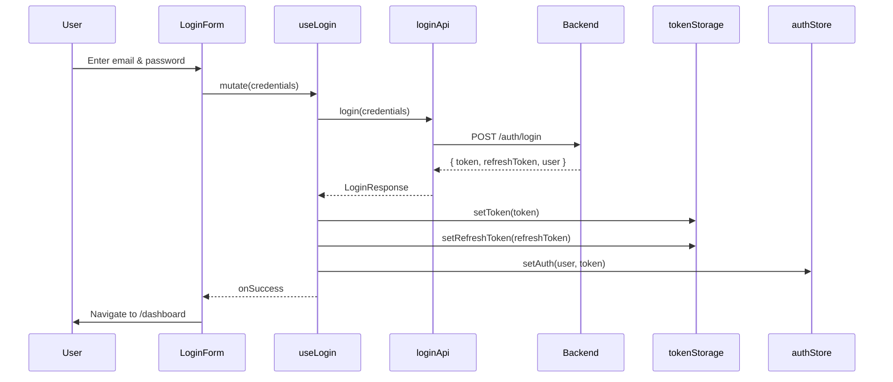
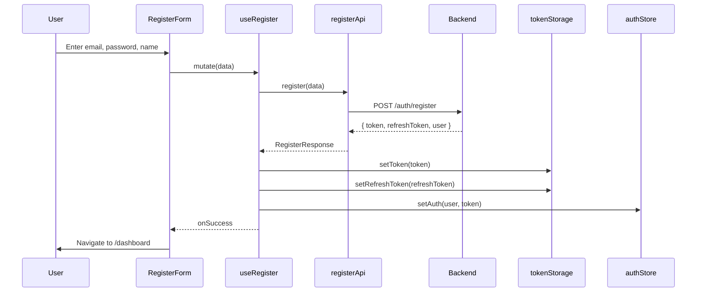
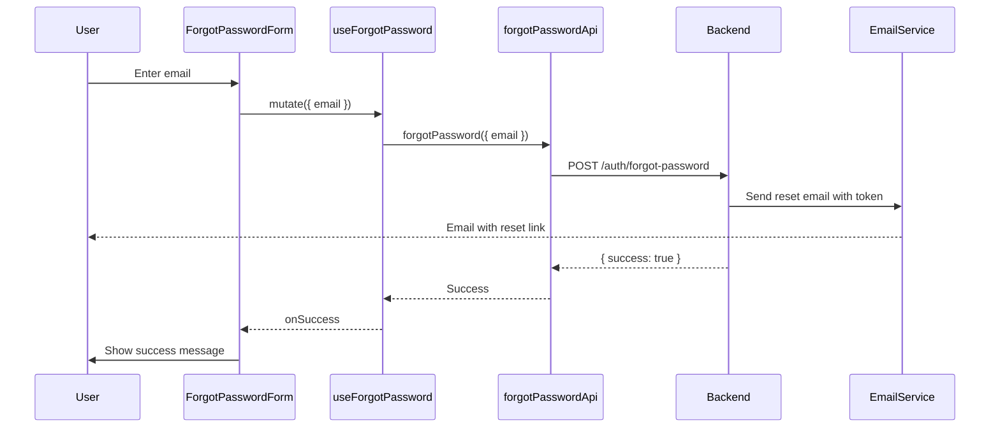
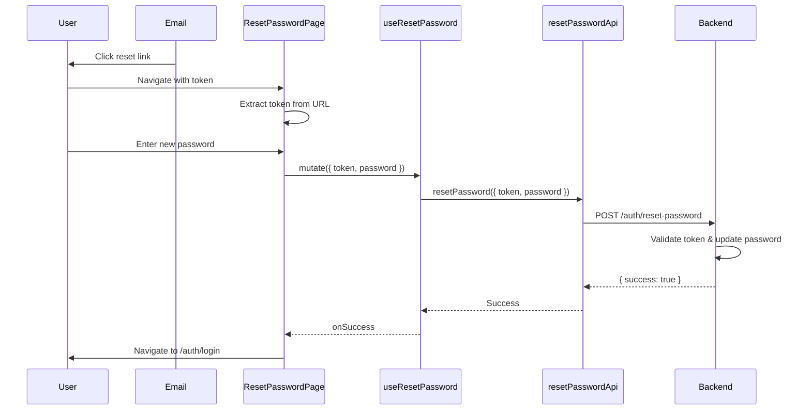
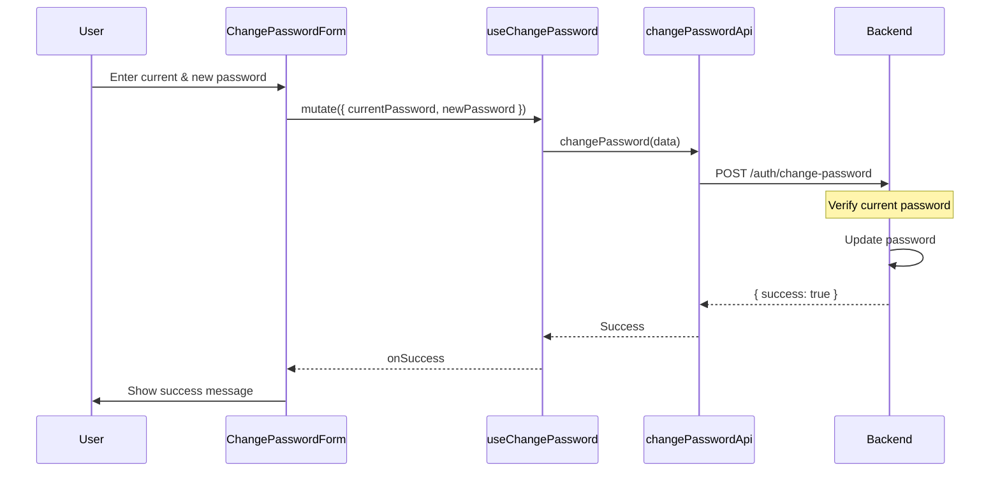
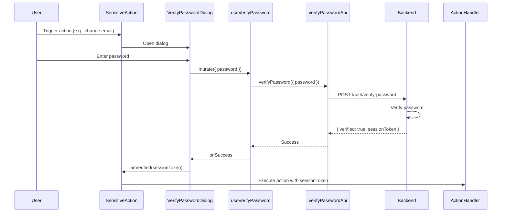
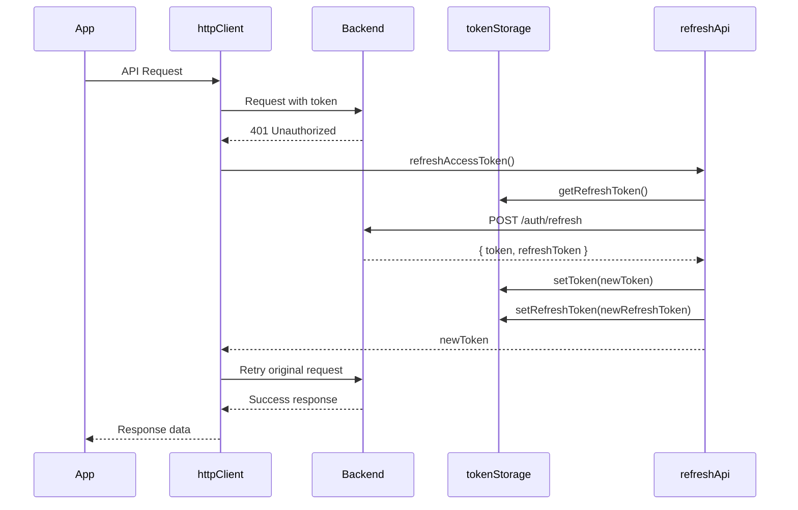
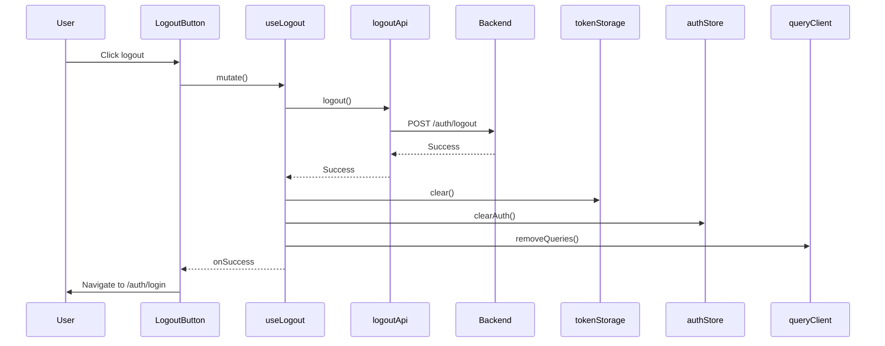

# Auth Flows Documentation

## 1. Login Flow

## 2. Register Flow

## 3. Forgot Password Flow

## 4. Reset Password Flow

## 5. Change Password Flow

## 6. Verify Password Flow (Sensitive Actions)

## 7. Token Refresh Flow

## 8. Logout Flow

