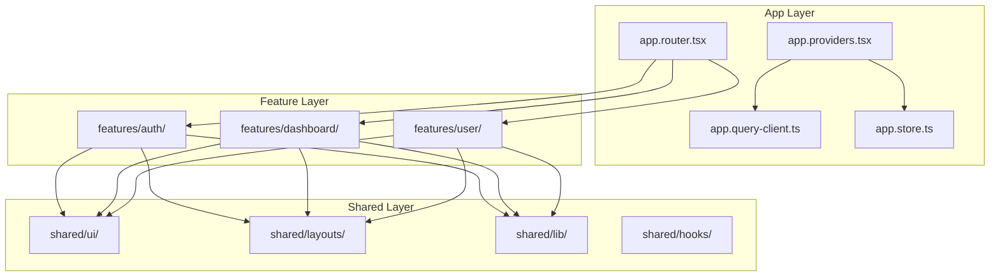
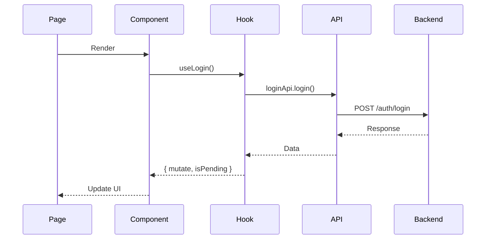

# 🏗️ Architecture Overview

Tổng quan về kiến trúc Feature-Based Architecture cho React 19 Base Project.

## 📋 Mục lục

- [Nguyên tắc cốt lõi](#nguyên-tắc-cốt-lõi)
- [Kiến trúc tổng quan](#kiến-trúc-tổng-quan)
- [Luồng dữ liệu](#luồng-dữ-liệu)
- [Import Strategy](#import-strategy)
- [Feature Isolation](#feature-isolation)

---

## 🎯 Nguyên tắc cốt lõi

### 1. Feature-First, Not File-First

Code được tổ chức theo **feature** (business domain), không theo **file type** (components, pages, utils).

```
✅ Đúng: features/auth/
❌ Sai: components/auth/, pages/auth/
```

### 2. Page chỉ Orchestration

Page chỉ **compose components**, không chứa business logic.

```typescript
// ✅ Đúng
export const LoginPage = () => {
  return <LoginForm />;
};

// ❌ Sai
export const LoginPage = () => {
  const { mutate } = useMutation(...); // Logic trong page
  return <form onSubmit={...}>...</form>;
};
```

### 3. Hooks là Trung tâm Logic

Tất cả business logic nằm trong **hooks**.

```typescript
// ✅ Đúng
export const useLogin = () => {
  return useMutation({
    mutationFn: loginApi.login,
  });
};

// Component chỉ sử dụng
const { mutate } = useLogin();
```

### 4. Shared là Pure

Shared layer **không phụ thuộc feature**, không chứa business logic.

```typescript
// ✅ Đúng: Pure utility
export const formatDate = (date: Date) => { ... };

// ❌ Sai: Business logic
export const formatUserDate = (user: User) => { ... };
```

### 5. API = 1 File/Endpoint

Mỗi API endpoint = 1 file riêng.

```
✅ Đúng:
api/login.api.ts
api/register.api.ts

❌ Sai:
api/auth.api.ts (chứa tất cả)
```

---

## 🏛️ Kiến trúc tổng quan



### Cấu trúc Layer

```
┌─────────────────────────────────────┐
│         App Layer                    │
│  (Router, Providers, Config)         │
└─────────────────────────────────────┘
              ↓
┌─────────────────────────────────────┐
│         Feature Layer               │
│  (auth, dashboard, user, ...)       │
│  - Mỗi feature độc lập              │
│  - Không import chéo                 │
└─────────────────────────────────────┘
              ↓
┌─────────────────────────────────────┐
│         Shared Layer                │
│  (UI, Layouts, Utils, Hooks)       │
│  - Pure, không business logic       │
│  - Không phụ thuộc feature          │
└─────────────────────────────────────┘
```

---

## 🔄 Luồng dữ liệu

### Data Flow trong Feature



### Query Flow với TanStack Query

```mermaid
graph LR
    A[Component] -->|useQuery| B[Hook]
    B -->|queryFn| C[API]
    C -->|HTTP| D[Backend]
    D -->|Response| C
    C -->|Data| B
    B -->|Cache| E[Query Client]
    E -->|Return| B
    B -->|{ data, isLoading }| A
```

---

## 📦 Import Strategy

### Path Aliases

```typescript
// App setup
import { queryClient } from '@app/app.query-client';

// Features
import { LoginForm } from '@features/auth/components/LoginForm';
import { useLogin } from '@features/auth/hooks/useLogin';

// Shared
import { Button } from '@shared/ui/Button';
import { formatDate } from '@shared/lib/date.utils';

// Locales
import { useTranslation } from 'react-i18next';
```

### Quy tắc Import

1. **Luôn dùng alias**, không dùng relative paths
2. **Không dùng barrel exports** (`index.ts`)
3. **Feature không import feature khác**

```typescript
// ✅ Đúng
import { Button } from '@shared/ui/Button';

// ❌ Sai
import { Button } from '../../../shared/ui/Button';
import { Button } from '@shared/ui'; // barrel export
```

---

## 🔒 Feature Isolation

### Nguyên tắc

- Mỗi feature là **đơn vị độc lập**
- Feature **không import** từ feature khác
- Feature chỉ import từ `shared/`

### Ví dụ

```typescript
// ❌ SAI: Feature import feature khác
// features/auth/components/LoginForm.tsx
import { useUser } from '@features/user/hooks/useUser';

// ✅ ĐÚNG: Chỉ import shared
import { Button } from '@shared/ui/Button';
import { useAuth } from '@features/auth/hooks/useAuth';
```

### Communication giữa Features

Nếu cần share data giữa features, dùng:

1. **Shared Store** (Zustand)
2. **Query Cache** (TanStack Query)
3. **URL/Route params**

---

## 📁 Cấu trúc Feature

Mỗi feature có cấu trúc chuẩn:

```
features/<feature-name>/
├── api/              # API calls (1 endpoint = 1 file)
├── pages/            # Route pages (orchestration only)
├── components/       # UI components
├── hooks/            # Business logic hooks
├── stores/           # Client state (Zustand)
├── types/            # TypeScript types
├── validators/       # Zod schemas
├── utils/            # Feature-specific utils
├── constants/         # Feature constants
└── <feature>.routes.tsx  # Route definitions
```

> 📖 Xem chi tiết: [Folder Structure](folder-structure.md)

---

## 🎨 Component Hierarchy

```
Page (orchestration)
  └── Component (UI + hooks)
      └── Shared UI Components
          └── HTML Elements
```

### Ví dụ

```typescript
// Page: Chỉ compose
export const LoginPage = () => {
  return <LoginForm />;
};

// Component: UI + hooks
export const LoginForm = () => {
  const { mutate, isPending } = useLogin();
  return (
    <form onSubmit={handleSubmit}>
      <Input ... />
      <Button loading={isPending}>Login</Button>
    </form>
  );
};
```

---

## 🔐 State Management

### Server State → TanStack Query

```typescript
// API data, caching, synchronization
const { data, isLoading } = useQuery({
  queryKey: ['users'],
  queryFn: fetchUsers,
});
```

### Client State → Zustand

```typescript
// UI state, form state, local preferences
const { isOpen, toggle } = useModalStore();
```

### Component State → useState

```typescript
// Local UI state (modal open, input value)
const [isOpen, setIsOpen] = useState(false);
```

---

## 🧪 Testing Strategy

### Test Pyramid

```
        E2E (Playwright)
      ──────────────────
    Integration (RTL + MSW)
  ────────────────────────────
Unit (hooks, utils, validators)
```

> 📖 Xem chi tiết: [Testing Strategy](../guides/testing-strategy.md)

---

## 📚 Tài liệu liên quan

- [Folder Structure](folder-structure.md) - Cây thư mục chi tiết
- [ADR-001: Architecture Decision](adr-001-architecture.md) - Quyết định kiến trúc
- [Creating a Feature](../guides/creating-feature.md) - Hướng dẫn tạo feature
- [Coding Conventions](../guides/coding-conventions.md) - Quy tắc viết code

---

**Kiến trúc này được thiết kế để scale, maintain và test dễ dàng! 🚀**
